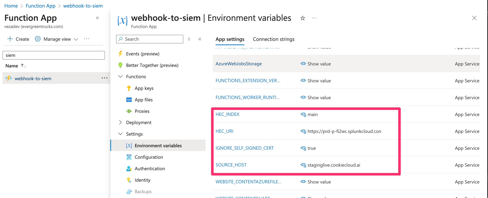

# Send Veza alert and access review action webhooks to SIEM

This Azure Function project provides a proxy app for reformatting Veza webhook messages for various SIEMs. The following SIEMs are currently supported:
1. Splunk

## 1. Splunk
Splunk provides a HTTP Event Collector (HEC), which lets you send data and application events to a Splunk deployment over HTTP and HTTPS. After configuring the HTTP Event Collector on Splunk (Configuraton differs depending on the platform - Refer to the [Splunk Documentation](https://docs.splunk.com/Documentation/SplunkCloud/9.2.2406/Data/UsetheHTTPEventCollector) for configuration steps), you will get the **HTTP Event Collector URL**, which accepts the HTTP POST message. The body of the message is in the format

```
{
  event: {
    kind: "test"
  },
  sourceType: "_json",
  host: "test",
  index: "main"
}
```
* `event` is any object representing the event message that you want to log
* `sourceType` should always be `_json`
* You may populate `host` with a value referring to the source of the message
* Default `index` to `main`, or you can use a different index of your choice.

Sending a Veza webhook message to HEC is as easy as embedding the original message in `event` before sending it in the above format to Splunk. The provided code [log-http-to-splunk.js](./src/functions/log-http-to-splunk.js) is an implementation using Azure Functions that accomlishes this task. Follow the below steps to deploy the function to Azure.

> We will be using Visual Studio Code to streamline the deployment process but you may use any method of your choice. Consult the Microsoft documentation for these alternatives.

### Create a Function App in Azure

1. Follow [these instructions](https://learn.microsoft.com/en-us/azure/azure-functions/create-first-function-vs-code-node?pivots=nodejs-model-v4#deploy-the-project-to-azure) to create the Function App
    * For the Runtime stack, select **Node.js xx** 

2. **Add environment variables:**
  
    After creating the above, locate the Function App in the Azure portal and add the following environment variables:

    | Name | Value |
    | ---- | ----- |
    | HEC_URI | The HTTP Event Collector URL to send events to |
    | SOURCE_HOST | (optional) This is what you want to populate `host` with in the message. If omitted, it will default to `veza` |
    | HEC_INDEX | (optional) This is value you want to populate `index` with in the mssage. If omitted, it will default to `main` |
    | IGNORE_SELF_SIGNED_CERT | This is an option to avoid TLS errors. For Splunk Cloud free trial accounts, set this to `true` to temporarily ignore certificate verification, as the cert here is self-signed. In production environments, this should be `false` or unset so that TLS is enabled |

    

### Deploy to Azure

**Deploy the project code to the above Function App using VS Code**

* Follow [these VS Code instructions](https://learn.microsoft.com/en-us/azure/azure-functions/create-first-function-vs-code-csharp#deploy-the-project-to-azure) to deploy the function code.

After successfully deploying the code, in your VSCode OUTPUT tab, you should see output similar to the following:

```
5:07:46 PM webhook-to-siem: Preparing deployment for commit id 'f17ab9a3a3'.
5:07:47 PM webhook-to-siem: Skipping build. Project type: Run-From-Zip
5:07:47 PM webhook-to-siem: Skipping post build. Project type: Run-From-Zip
5:07:47 PM webhook-to-siem: Triggering recycle (preview mode disabled).
5:07:48 PM webhook-to-siem: Deployment successful.
5:07:48 PM webhook-to-siem: Started postDeployTask "npm install (functions)".
5:07:59 PM webhook-to-siem: Syncing triggers...
5:08:03 PM webhook-to-siem: Querying triggers...
5:08:05 PM webhook-to-siem: HTTP Trigger Urls:
  log-http-to-splunk: https://webhook-to-siem.azurewebsites.net/api/log-http-to-splunk
```


### 1. Setup an Orchestration Action in Veza

* Navigate to **Integrations > Orchestration Actions** 
* Choose the **Webhook** provider and click *Next*
* Enter the required details:
  | Field | Description | Example |
  | ----- | ----------- | ------- |
  | Name  | Provide a name for the Orchestration Action | `Splunk HEC` |
  | URL   | The POST endpoint of the deployed service (see example output from above) | `https://webhook-to-siem.azurewebsites.net/api/log-http-to-splunk` |
  | Authentication | Choose `Token` | `Token` |
  | Authorization Token | Enter the Splunk token to authenticate the HTTP Event Collector URL | `c7636d11-2719-4ae8-3329-938acd2b8763` |

### 2. Add a Webhook to a rule:
Webhooks can be attached to rules by opening the *rule builder*, accessed from the **Access Intelligence** > *Rules & Alerts*, or from **Access Search** > *Saved Queries*.
* From *Rules*, edit an existing rule or create a new one to open the rule builder
* From the *Saved Queries* list, choose "Create a Rule" from the actions list
* On the Edit Rule screen, **Action** tab, select *Deliver Alert via Webhook/Email* and set an existing webhook

